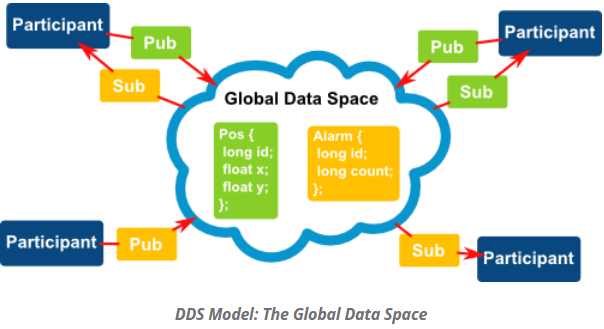
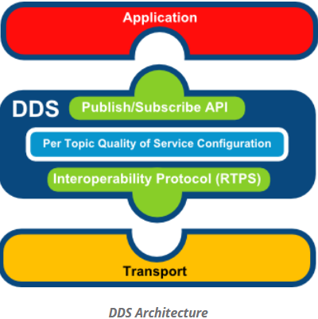

## What's DDS

DDS(Data Distribution Service for Real-Time Systems) 是 [OMG(Object Management Group)](https://www.omg.org) 最早发布于2003 并2007年重新修订的开放标准. 该标准定义了基于发布-订阅通讯中间件的分布式系统API.

分布式系统上的应用使用DDS基于发布和订阅主题信息以及Qos进行信息通讯,具有可靠性,持久化,冗余化,生命周期,传输设置,资源配置等等特点

## DDS MODEL

DDS的模型非常易于理解,基于发布-订阅模型, 类似于消息中间件JMS, MQTT等.

Topic: 主题是定义在分布式系统中需要共享和交换的数据名称, 每个主题都有关联的具体数据信息. 主题信息存在于称之为 "Global Data Space" 公共数据区域.
需要注意的是在大多数DDS实现里, 没有中转路由的 **broker** 在JMS, MQTT等消息中间件里有的组件.

Publisher/Subscriber: 发布者/订阅者统称为Participant参与者,应用需要通过DDS工厂来创建进行交互.

Discovery: 服务/参与者的发现一般是自动的, 在默认的实现里每一个参与者通过发送组播包了告知其他协作者自身的信息, 自身也存储维护接收到的类似的组播信息.

## DDS Architecture

DDS在大多的实现里都以静态或动态库链接到应用里,不需要安装服务和后台程序.

RTPS(Real-Time Publish Subscribe)协议是在OSI七层模型中传输层之上的,故该协议的实现可以基于传输层任何可以的技术. 
一些DDS的实现将传输层的机制作为一个可插拔式的方式并提供典型的传输选项, UDP,TCP 和 Shared Memory

## DDS Advantages

* Publish/Subscribe Model: 简单和解耦
* Performance: Latency延迟较低, 吞吐量高于请求/响应模式
* Automatic Discovery of remote participants: 这个是DDS的一个关键机制. 交互通讯是匿名和解耦的, 开发人员不需要关注远程参与者的地址
* Rich set of Qos parameters: 允许优化通信的每一个方面的参数:可靠性,持久化,冗余化,生命周期,传输设置,资源
* Interoperability Protocol(RTPS): 允许DDS可以基于UDP,TCP 和 Shared Memory, 同时可以具备在多个不同DDS实现间进行实时交互功能.

## DDS Implementations

[Fast DDS](https://github.com/eProsima/Fast-DDS)
[Open DDS](https://github.com/objectcomputing/OpenDDS)

## Reference Links

[OMG Official Site](https://www.omg.org)

[OMG DDS](https://www.omg.org/spec/DDS/1.4/PDF)

[OMG DDSI-RTPS](https://www.omg.org/spec/DDSI-RTPS/2.3)

[OMG DDS Security](https://www.omg.org/spec/DDS-SECURITY/1.1)

[一文读懂“数据分发服务DDS”](https://blog.csdn.net/DDS_CSIT/article/details/104607476)

[分布式实时通信——DDS技术](https://zhuanlan.zhihu.com/p/192981171)