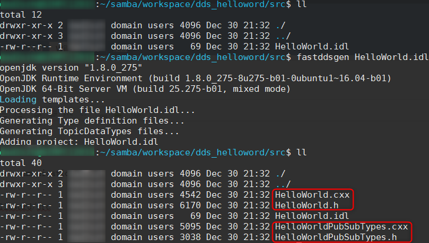
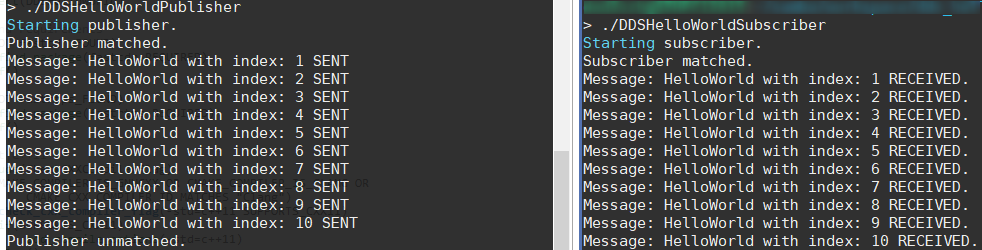
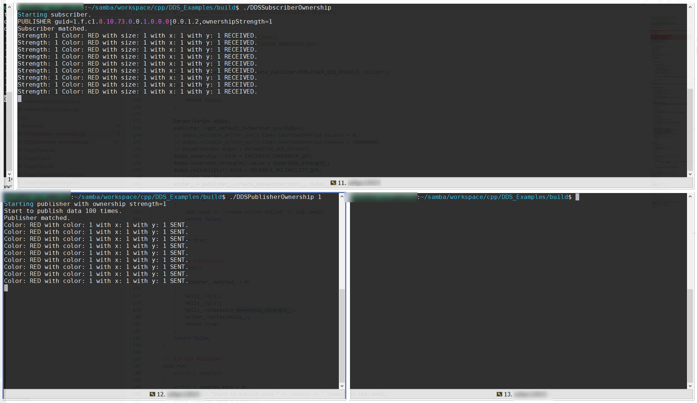
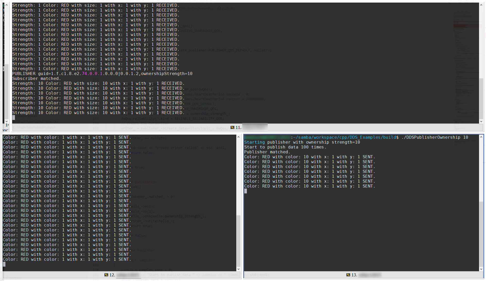
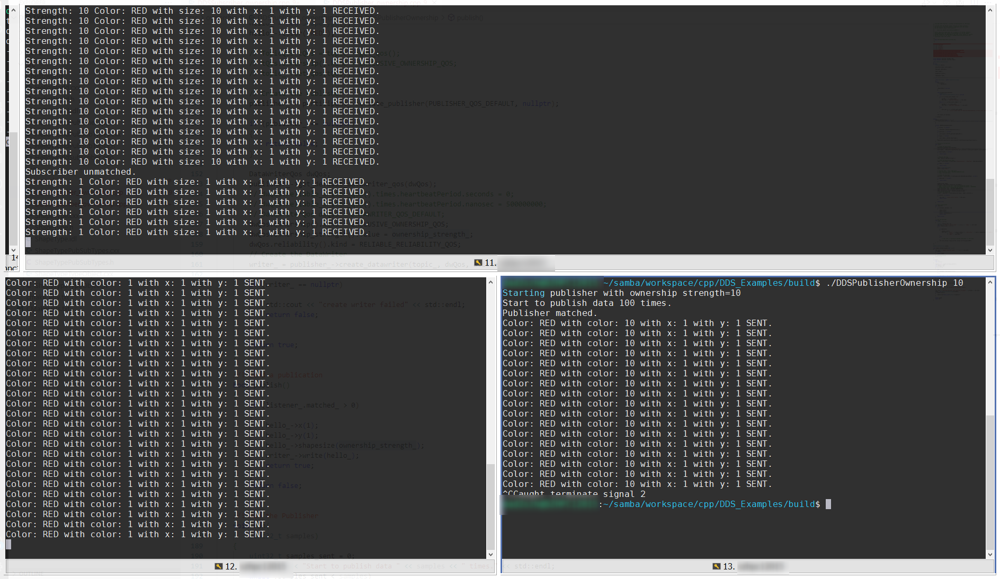

# Fast DDS Example

You can get sample code from [DDS helloworld code](../code/dds_helloword)

## IDL definition & generation

IDL file is description of data types for communication.

```
mkdir -p dds_helloword/src/helloworld && cd dds_helloword/src/helloworld
gedit HelloWorld.idl
```

```idl
/* HelloWorld definition */
struct HelloWorld
{
    unsigned long index;
    string message;
};
```

generate `.h` and `.cxx` files.

```shell
fastddsgen HelloWorld.idl
```


## Add publisher/subscriber participant

You can follow [Official Sample Guide](https://fast-dds.docs.eprosima.com/en/latest/fastdds/getting_started/simple_app/simple_app.html)

### add publisher participant

```shell
cd dds_helloword/src/helloworld
wget -O HelloWorldPublisher.cpp \
    https://raw.githubusercontent.com/eProsima/Fast-RTPS-docs/master/code/Examples/C++/DDSHelloWorld/src/HelloWorldPublisher.cpp
```

Here list initialization code of dds publisher participant for overview

```c++
//!Initialize the publisher
bool init()
{
    hello_.index(0);
    hello_.message("HelloWorld");

    DomainParticipantQos participantQos;
    participantQos.name("Participant_publisher");
    participant_ = DomainParticipantFactory::get_instance()->create_participant(0, participantQos);

    if (participant_ == nullptr)
    {
        return false;
    }

    // Register the Type
    type_.register_type(participant_);

    // Create the publications Topic
    topic_ = participant_->create_topic("HelloWorldTopic", "HelloWorld", TOPIC_QOS_DEFAULT);

    if (topic_ == nullptr)
    {
        return false;
    }

    // Create the Publisher
    publisher_ = participant_->create_publisher(PUBLISHER_QOS_DEFAULT, nullptr);

    if (publisher_ == nullptr)
    {
        return false;
    }

    // Create the DataWriter
    writer_ = publisher_->create_datawriter(topic_, DATAWRITER_QOS_DEFAULT, &listener_);

    if (writer_ == nullptr)
    {
        return false;
    }
    return true;
}
```

### add subscriber participant

```shell
cd dds_helloword/src/helloworld
wget -O HelloWorldSubscriber.cpp \
    https://raw.githubusercontent.com/eProsima/Fast-RTPS-docs/master/code/Examples/C++/DDSHelloWorld/src/HelloWorldSubscriber.cpp
```

Here list initialization and callback `on_data_avaiable` code of dds subscriber participant for overview

```c++
//!Initialize the subscriber
bool init()
{
    DomainParticipantQos participantQos;
    participantQos.name("Participant_subscriber");
    participant_ = DomainParticipantFactory::get_instance()->create_participant(0, participantQos);

    if (participant_ == nullptr)
    {
        return false;
    }

    // Register the Type
    type_.register_type(participant_);

    // Create the subscriptions Topic
    topic_ = participant_->create_topic("HelloWorldTopic", "HelloWorld", TOPIC_QOS_DEFAULT);

    if (topic_ == nullptr)
    {
        return false;
    }

    // Create the Subscriber
    subscriber_ = participant_->create_subscriber(SUBSCRIBER_QOS_DEFAULT, nullptr);

    if (subscriber_ == nullptr)
    {
        return false;
    }

    // Create the DataReader
    reader_ = subscriber_->create_datareader(topic_, DATAREADER_QOS_DEFAULT, &listener_);

    if (reader_ == nullptr)
    {
        return false;
    }

    return true;
}
```

```c++
void on_data_available(
        DataReader* reader) override
{
    SampleInfo info;
    if (reader->take_next_sample(&hello_, &info) == ReturnCode_t::RETCODE_OK)
    {
        //if (info.instance_state == ALIVE_INSTANCE_STATE)
        //{
            samples_++;
            std::cout << "Message: " << hello_.message() << " with index: " << hello_.index()
                        << " RECEIVED." << std::endl;
        //}
    }
}
```

**NOTE**: please comment statement `if (info.instance_state == ALIVE_INSTANCE_STATE)` if compile error.

## Add CMake file

```shell
cd dds_helloword
gedit CMakeLists.txt
```

```cmake
cmake_minimum_required(VERSION 3.12.4)

if(NOT CMAKE_VERSION VERSION_LESS 3.0)
    cmake_policy(SET CMP0048 NEW)
endif()

project(DDSHelloWorld)

# Find requirements
if(NOT fastcdr_FOUND)
    find_package(fastcdr REQUIRED)
endif()

if(NOT fastrtps_FOUND)
    find_package(fastrtps REQUIRED)
endif()

# Set C++11
include(CheckCXXCompilerFlag)
if(CMAKE_COMPILER_IS_GNUCXX OR CMAKE_COMPILER_IS_CLANG OR
        CMAKE_CXX_COMPILER_ID MATCHES "Clang")
    check_cxx_compiler_flag(-std=c++11 SUPPORTS_CXX11)
    if(SUPPORTS_CXX11)
        add_compile_options(-std=c++11)
    else()
        message(FATAL_ERROR "Compiler doesn't support C++11")
    endif()
endif()

message(STATUS "Configuring HelloWorld publisher/subscriber example...")
file(GLOB DDS_HELLOWORLD_SOURCES_CXX "src/helloworld/*.cxx")

add_executable(DDSHelloWorldPublisher src/helloworld/HelloWorldPublisher.cpp ${DDS_HELLOWORLD_SOURCES_CXX})
target_link_libraries(DDSHelloWorldPublisher fastrtps fastcdr)

add_executable(DDSHelloWorldSubscriber src/helloworld/HelloWorldSubscriber.cpp ${DDS_HELLOWORLD_SOURCES_CXX})
target_link_libraries(DDSHelloWorldSubscriber fastrtps fastcdr)

file(GLOB DDS_OWNERSHIP_SOURCES "src/ownership/*.cxx")
set(DDS_OWNERSHIP_SOURCES_HEADER "src/ownership")

add_executable(DDSPublisherOwnership src/ownership/DDSPublisher_ownership.cpp ${DDS_OWNERSHIP_SOURCES})
target_include_directories(DDSPublisherOwnership PRIVATE ${DDS_OWNERSHIP_SOURCES_HEADER})
target_link_libraries(DDSPublisherOwnership fastrtps fastcdr)

add_executable(DDSSubscriberOwnership src/ownership/DDSSubscriber_ownership.cpp ${DDS_OWNERSHIP_SOURCES})
target_include_directories(DDSSubscriberOwnership PRIVATE ${DDS_OWNERSHIP_SOURCES_HEADER})
target_link_libraries(DDSSubscriberOwnership fastrtps fastcdr)
```

## Build

```shell
cd dds_helloworld && mkdir build && cd build
cmake ..
make clean && make
```

## Run

### Helloworld sample
start two command terminals.

```shell
cd dds_helloworld/build
./DDSHelloWorldPublisher

./DDSHelloWorldSubscriber
```




### Ownership sample

start three command terminals

```shell
cd dds_helloworld/build
./DDSSubscriberOwnership
 
// new terminal, low strength publisher
./DDSPublisherOwnership 1
 
// new terminal, higher strength publisher
./DDSPublisherOwnership 10
```

start subscriber and strength=1 publisher


start strength=10 publisher


shutdown strength=10 publisher


